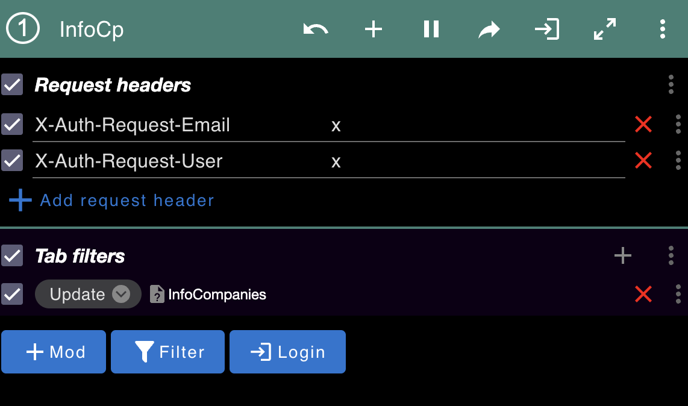

# Info'Companies

This app is made with Vite.js and React.

To start the app, follow the commands below:

-pnpm install
-pnpm run dev

If you want to check a template of the app:

[Info'Companies](https://matithieu.com/ui)

# Docs

How to add a filter -

- filtersStore.ts
  - Add the filter inside
- filter.type.ts
  - Add the translation
  - Add the type to SelectedFilterType
- filter.util.tsx
  - if not object like string etc : Add special way to verify
- index.tsx
  - Add the name of the filter inside the props
  - Inide the useState, handleSearch and useEffect
- components/index.tsx
  - Add the filter as so:
    - filter : (...)
- landing page
- constructUrlWithFilter

# Target local bakend

To target the local backend, use the following command:

```sh
VITE_API_PREFIX=http://localhost:8083/api pnpm run dev
```

# Browser extension

You can install ModHeader extension on your browser to add the following headers:

```sh
X-Auth-Request-Email: xxx
X-Auth-Request-User: xxx
```

The headers are used to authenticate the user.

_Tab filter on the URL doesn't work_


